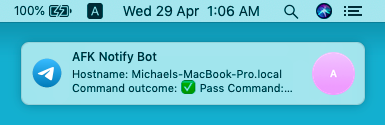
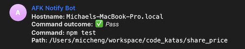

# AFK Command Line Utility

Use this utility to notify you on Telegram when your long running command finishes running.

## How to use

1. Copy the `afk` file into your bin path (eg. `/usr/local/bin`)

    ```
    cp afk /usr/local/bin/
    ```

2. Get a [Telegram bot](https://core.telegram.org/bots). You will need to get the `bot_token` and a recipient `chat_id`.

3. Add a `.akfconfig` file to your home directory with this content:

    ```bash
    AFK_BOT_TOKEN=<the Telegram bot token from the @botfather>
    RECIPIENT_ID=<chat_id of recipient - either a person or a group>
    ```

    **_Note:_ `afk` will first look in your current folder for a `.afkconfig` file before looking inside `$HOME`.**

4. Prepend `afk` to your command:

    ```bash
    afk <command>
    ```

    Example:

    ```bash
    afk npm test
    ```
    
    

5. Telegram messages should show up:
    
    
    
    

## Dependency

- cURL (in the command line)

## License

MIT
